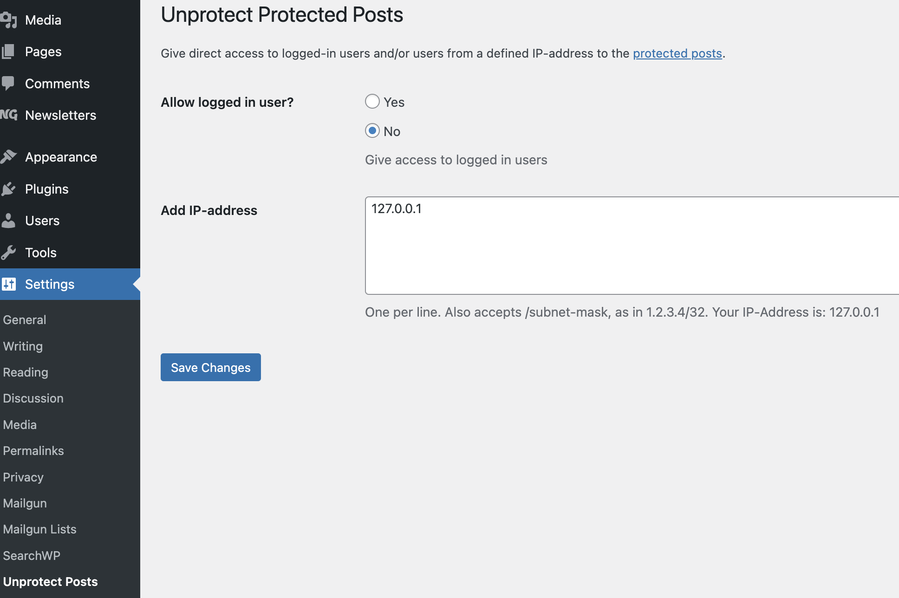

# Unprotect Protected Posts

Give access to logged-in users and/or users from a defined IP-address to the [protected posts](https://wordpress.org/support/article/using-password-protection/#password-protected-posts).

## Copyright and License

Unprotect Protected Posts is copyright 2022+ Per Soderlind

Unprotect Protected Posts is free software: you can redistribute it and/or modify it under the terms of the GNU General Public License as published by the Free Software Foundation, either version 2 of the License, or (at your option) any later version.

Unprotect Protected Posts is distributed in the hope that it will be useful, but WITHOUT ANY WARRANTY; without even the implied warranty of MERCHANTABILITY or FITNESS FOR A PARTICULAR PURPOSE. See the GNU General Public License for more details.

You should have received a copy of the GNU Lesser General Public License along with the Extension. If not, see http://www.gnu.org/licenses/.
